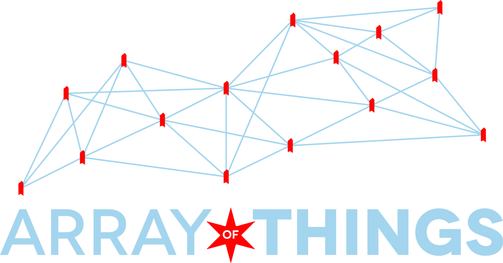

**An Array of Things Project:**

# CommunitySensing

The [ddiLab](http://ddilab.cs.niu.edu) at [Northern Illinois University](http://www.cs.niu.edu) is part of the [Array of Things](https://arrayofthings.github.io) project led by [Argonne National Laboratory](http://www.mcs.anl.gov/project/array-things) and [The University of Chicago](http://www.urbanccd.org); with the goal of involving undergraduate students in research and development.  The ddiLab in addition to participating in the testing and deployment of [AoT Nodes](https://arrayofthings.github.io/node.html), has been working on hardware systems that share in the goals of of the AoT project in the collection of real-time data from the environment, infrastructure sources, and human activity. The team has also been building [jupyter notebooks](http://jupyter.org) for others to learn how to investigate and explore the output of these system.

Notebooks we have built:
- Introduction to Raspberry Pi
- Introduction to Raspberry Pi with Sense HAT

The ddiLab Community Sensing Team:
- Michael E. Papka
- James Bonasera
- Thomas Franczak
- May-Myo Khine
- Kevin White
- Alex Wills

<small>This work is part an NSF funded MRI: [Development of an Urban-Scale Instrument for Interdisciplinary Research](https://www.nsf.gov/awardsearch/showAward?AWD_ID=1532133&HistoricalAwards=false).

*This material is based upon work supported by the National Science Foundation under Grant No. OAC-1532133. Any opinions, findings, and conclusions or recommendations expressed in this material are those of the author(s) and do not necessarily reflect the views of the National Science Foundation.*</small>
